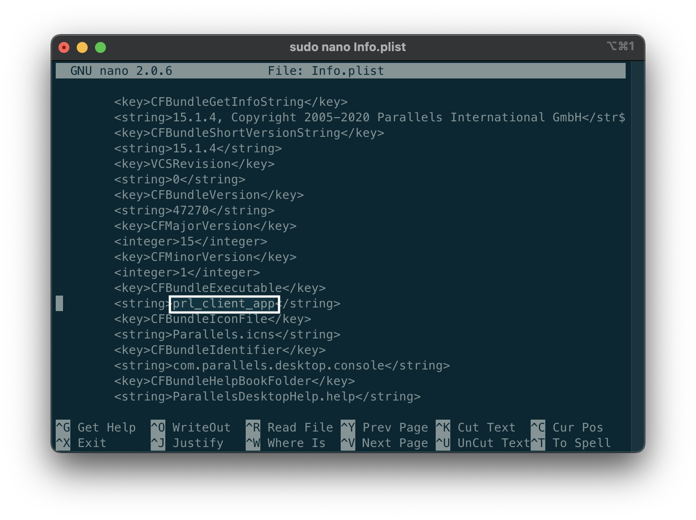

# prl_starter

## How to apply (English)

1. Download `prl_starter` file from [here](https://github.com/aroxu/prl_starter/releases)
2. open Terminal
3. type this:
   ```bash
   cp /path/to/download/prl_starter /Applications/Parallels\ Desktop.app/Contents/MacOS && sudo nano /Applications/Parallels\ Desktop.app/Contents/Info.plist
   ```
4. Find and replace `prl_client_app` to `prl_starter` under `CFBundleExecutable`, Then press `Ctrl + X`, `Y`, `Enter`. Please refer to the screenshot below and modify it.
   
5. Run Parallels Desktop 15 as normal.
6. Done!

## 적용방법 (한국어)

1. `prl_starter` 파일을 [여기](https://github.com/aroxu/prl_starter/releases)에서 다운로드 받습니다.
2. 터미널을 엽니다.
3. 다음 명령어를 입력하세요:
   ```bash
   cp /path/to/download/prl_starter /Applications/Parallels\ Desktop.app/Contents/MacOS && sudo nano /Applications/Parallels\ Desktop.app/Contents/Info.plist
   ```
4. `CFBundleExecutable` 아래에 있는 `prl_client_app`를 찾아 `prl_starter`로 바꾸고, `Ctrl + X`, `Y`, `Enter`를 누릅니다. 아래 스크린샷을 참고해서 수정하세요.
   
5. Parallels Desktop 15를 평소대로 실행하세요.
6. 끝!
